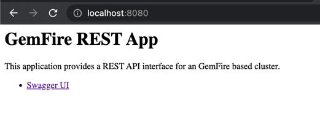

 # GemFire REST Microservice

This is a Spring Boot based app that provides the following GemFire features 
- Supports region CRUD operations
- POST region with region key and value to put data into a region
- GET region name and key to read
- QUERY region data with OQL (GemFire's SQL language)
- Uses pure PDX instances without dependencies on having Java Classes in CLASSPATH
- Queries PDX (select * from /region) 
- Query Core Java datatypes within PDX objects (select field1, field2 from /region)
- Swagger test UI

Requires Pivotal GemFire various 9.15 and higher

# User Interface

You can access API doc and a test swagger UI from the root URL
(example http://localhost:8080/)



 
### REST Application Configuration

When starting the application you must provide the required ENVironment variables

- LOCATOR_HOST=**public IP address or Public Host Name**
- LOCATOR_PORT =**Locator Port**
- name =**Client Name**

or for multiple locators use multiple host[port] separated by semi-colons
    
- LOCATORS=host1[10334],host2[10334],...

Example connection settings
	
	export LOCATORS=localhost[10334]
	export name=GEMFIRE_REST_CLIENT

 **Optional Settings**

With defaults

	export PDX_SERIALIZER_CLASS_NM=...   (default org.apache.geode.pdx.ReflectionBasedAutoSerializer)

	export POOL_PR_SINGLE_HOP_ENABLED=false
	export PDX_CLASS_PATTERN=.*
	export USE_CACHING_PROXY=false
	export PDX_READ_SERIALIZED=false
	
	
If authentication is enabled
	
	export SECURITY_USERNAME=user
	export SECURITY_PASSWORD=password
    

If you need to set PDX read serialize to true (default false).

    export PDX_READ_SERIALIZED=true
    
    **Cloud Foundry/ Pivotal Cloud Cache (PCC) Friendly**
 
 Pivotal Cloud Cache [PCC](https://docs.pivotal.io/p-cloud-cache/index.html) is [Pivotal](http://pivotal.io)'s [12-factor](https://12factor.net/) [backing service](https://12factor.net/backing-services) implementation of GemFire. GeodeClient.connect method supports automatically wiring the locators hosts, ports and security credential when the PCC service is binded a Cloud Foundry application that using this API.
 
 
 See [https://docs.pivotal.io/p-cloud-cache/using-pcc.html#bind-service](https://docs.pivotal.io/p-cloud-cache/using-pcc.html#bind-service)
 
	cf bind-service [appNAme] [pcc-service]
 
 
**SSL key/trust store management**
    
If you need SSL keystore/truststores loading via CLASSPATH for 
12 factor cloud native applications such as cloud foundry Spring Boot application
see the properties below. 

	export SSL_KEYSTORE_PASSWORD=...
	export SSL_PROTOCOLS=TLSv1.2
	export SSL_TRUSTSTORE_PASSWORD=...
	export SSL_KEYSTORE_TYPE=jks
	export SSL_CIPHERS=TLS_RSA_WITH_AES_128_GCM_SHA256
	export SSL_ENABLED_COMPONENTS=gateway,server,locator,jmx
	export SSL_REQUIRE_AUTHENTICATION=true
	export SSL_TRUSTSTORE_CLASSPATH_FILE=truststore.jks
	export SSL_KEYSTORE_CLASSPATH_FILE=keystore.jks
    
	
	
The following are optional settings
	
	export POOL_PR_SINGLE_HOP_ENABLED=true


## Getting Started

### REST Application startup

```shell
java -jar applications/gemfire-rest-app/build/libs/gemfire-rest-app-0.0.1-SNAPSHOT.jar
```

### Starting GemFire

Start a simple GemFire Cluster

```
cd $GEMFIRE_HOME/bin
```

Start gfsh

```shell script
./gfsh
```

In Gfsh start a locator

```shell script
start locator --name=locator
```

In Gfsh, Enable PDX serializer

```shell script
configure pdx --read-serialized=true --disk-store=DEFAULT
```

In Gfsh, Start a DataNode/Cache Server

```shell script
start server --name=server1
```

In Gfsh create a region

```shell script
create region --name=test --type=PARTITION
```


# REST Application Endpoints 

## Region

The URL http://**root**/region prefix exposes a REST interface to preform READ/WRITE 
operations on a GemFire region.

### POST region

Put a  key/value entry into a given region.

**NOTE** The value is expected to be a JSON string

**Format** 

	http://<root>/region/<regionName>/<key>
	
	POST BODY
		<json>


NOTE: YOU must specify the "@type" element in the JSON payload with the classname of the 
domain name.

```json
{ "id": "1", "name":"Imani", "@type:": "company.User"}
```

*Example*

HTTP POST

```shell script
curl -X POST "http://localhost:8080/region/test/1" -H "accept: application/json" -H "Content-Type: application/json" -d "{ \"id\": \"1\", \"name\":\"Imani\", \"@type:\": \"company.User\"}"
```

RESPONSE

{ "name" : "world"}


### GET region

Get a region value based on a given key

**Format** 

	http://<root>/region/<regionName>/<key>
	
*Example*

HTTP GET

http://localhost:8080/region/Test/hello

RESPONSE

{ "name" : "world"}


## Query

Perform a GemFire query operation
http://host:port/query 

* Note the select assumes the results of PdxInstances 

HTTP POST 

http://localhost:8080/query

    
    select * from /region 


Appending a number the limit the number of results returned. 

    http://host:port/query/limitNumber
	

HTTP POST 

http://localhost:8080/query/10

    
    select * from /region


# Docker 

Use the maven plugin to containerize the Spring Boot application. 

```shell script
mvn spring-boot:build-image
```

List docker images

```shell script
docker images
```

You should see the image **gemfire-rest-app** with the  current version number.


kind load docker-image gemfire-rest-app:0.0.1-SNAPSHOT --name=kind

```shell script
kubectl apply -f cloud/k8
```


