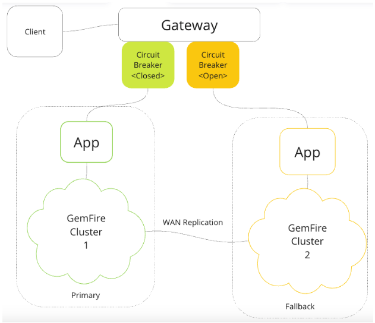

# GemFire Fail-Over Best Practices

The following outlines step to demonstrate
Client Application Fail-Over using [Tanzu GemFire](https://tanzu.vmware.com/gemfire).


GemFire WAN replication is recommended to meet high availability disaster recovery requirements across geographical areas. GemFire WAN replication supports ACTIVE to ACTIVE replication between the clusters. Clients connect using an API Gateway circuit breaker pattern to App service backed by GemFire. See the Architecture below.




In this architecture, the gateway routes traffic to the primary App service when the circuit is closed. The primary should be the nearest to the client to reduce network latency.
App service calls are routed to a fallback geographical location when the circuit is open. Since GemFire WAN replication synchronizes data across both locations, data will be available to the fallback service in real-time. Note that an open circuit will introduce additional latency.

## Prerequisite

- Java 17
- [Tanzu GemFire](https://tanzu.vmware.com/gemfire) version 10 or higher
- Gradle version 8.4
- Build application

# GemFire Fail-over Demonstration

Start the 2 GemFire Clusters locally using the script.

Note: Please change the location of the export GEMFIRE_HOME as needed

```shell
export GEMFIRE_HOME=/Users/devtools/repositories/IMDG/gemfire/vmware-gemfire-10.0.2
./deployments/scripts/multi-cluster/start.sh
```


## Start Data Services 

Start application that points to cluster 1

```shell
java -jar examples/spring-data-gemfire/applications/account-service/build/libs/account-service-0.0.1-SNAPSHOT.jar --gemfire.health.region.name=health1  --server.port=8181 --spring.data.gemfire.pool.default.locators="localhost[10001]"
```


Start application that points to cluster 2

```shell
java -jar examples/spring-data-gemfire/applications/account-service/build/libs/account-service-0.0.1-SNAPSHOT.jar --gemfire.health.region.name=health2    --server.port=8282 --spring.data.gemfire.pool.default.locators="localhost[10002]"
```

Start Spring Gateway

```shell
java -jar examples/spring-gateway-healthcheck/build/libs/spring-gateway-healthcheck-0.0.1-SNAPSHOT.jar
```


---------------
# Testing


Save account 1

```shell
curl -X 'POST' \
  'http://localhost:8080/accounts' \
  -H 'accept: */*' \
  -H 'Content-Type: application/json' \
  -d '{
  "id": "1",
  "name": "1"
}'
```

Get Account 1

```shell
curl http://localhost:8080/accounts/1
```

Save account 2

```shell
  curl 'http://localhost:8080/accounts' \
  -H 'accept: */*' \
  -H 'Content-Type: application/json' \
  -d '{
  "id": "2",
  "name": "2"
}'
```

Get Account 2
```shell
curl -X 'GET' \
  'http://localhost:8080/accounts/2' \
  -H 'accept: */*'
```

Test Actuator for App Service to cluster 1

- Expected result is 
```json
{"status":"UP"}% 
```

```shell
curl http://localhost:8181/actuator/health
```

Stop Cluster One Servers

```shell
$GEMFIRE_HOME/bin/gfsh -e "connect --locator=localhost[10001]" -e "shutdown"
```

Check app service to cluster 1

```shell
curl http://localhost:8181/actuator/health
```
- Expected 
```json
{"status":"DOWN"}% 
```

Get Account 1

```shell
curl http://localhost:8080/accounts/1
```

Check app service to cluster 2

```shell
curl http://localhost:8282/actuator/health
```


$GEMFIRE_HOME/bin/gfsh -e "connect --locator=localhost[10002]" -e "shutdown --include-locators"
